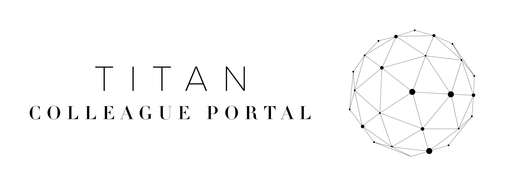

# Introduction

Welcome to the Titan Colleague Portal Management App. In this app you can add/edit/delete colleagues to your databases, assign that colleague within a specific department, and edit/delete those departments, and add/edit/delete that colleagues personal data with the ability to find their personal data quickly. 

In many business today, and many I have worked in, personal details and information are still kept in a huge folder somewhere in an office, and to find this data in a huge pile of paper is not efficient, or secure, especially concerning GDPR, and especially when your trying to find cover quickly for your business. Which is why this app has been developed to solve real world issues, for companies with large colleague numbers to deal with issues and problems more efficiently. This app allows companies to upload their colleagues information relating to their job role, which department they work in, including personal information such as contact numbers, all within a secure app at only lets the authorised users effect any changes.

Live site can be viewed here: https://titan-milestone-3.herokuapp.com/

# Contents

* [**User Experience UX**](<#user-experience-ux>)
    * [**Purpose**](#purpose)
    * [**User Stories**](#user-stories)
    * [**Wireframes**](#wireframes)
    * [**Web Design**](#web-design)
    * [**Accessibility**](#accessibility)
* [**Website Walkthrough**](#website-walkthrough)
* [**Methods For Creating The Site**](#methods-for-creating-the-site)
* [**Testing**](#testing)
    * [**Development Testing**](#development-testing)
    * [**Deployment Testing**](#deployment-testing)
    * [**Code Validation**](#code-validation)
* [**Bugs**](#bugs)
* [**Deployment**](#deployment)

# User Experience (UX) design

## Purpose
  [Go to the top](#contents)

The purpose for this app is to safetly store colleagues details, to be able to organise your colleagues into departments, and be able to structure your business effectively, and handling this information in a app safetly so that every member of a management structure could have this at the tips of their fingers on their phones or on company desktops.

When I have been running stores myself, especially with high staff numbers. It takes time to find someones details to find cover for a shift or to get hold of them concerning overtime, or even making sure you know everyone who works within a department. This app streamlines precious time for management, while organising the information more effectively.

This is why in developing this app, we have used POSTGRESQL and SQLALCHEMY to create a relational database which ties colleagues to a specific department of your choice, and is why weve used MONGODB for the larger content of a colleagues personal information.

## User Stories
  [Go to the top](#contents)

1. - I the user, upon loading the site see an overview of what the application is
2. - I the user, have the ability to register a username and log into the application
3. - I the user, am notified when I have used the incorrect Username/Password
4. - I the user, am notified when i have successfully logged into the application
5. - I the user, can add/edit/delete a department into the database
6. - I the user, can add/edit/delete a colleague into the database
7. - I the user, can assign a colleague to a specific department
8. - I the user, can add/edit/delete a colleagues personal information into the database
9. - I the user, have the ability to log out, and am notified when this is successful.
10. - I the user, am notified of any actions taken such as edit/delete

## WireFrames
  [Go to the top](#contents)

- 

## Web Design
  [Go to the top](#contents)

This application has been designed with the following main principles:
- Simple and easy to navigate
- Completely responsive across all devices
- A light and tech style background that could be used for any business
- To look like a modern application
- Ensuring no contrast issues between background and foreground content 
- To provide a service for managers and businesses that will save time and help structure/organise their business.

I wanted to keep the design of this application as simple as possible, mainly for ease of use by the user but to also keep it as strictly a functional application as possible. Which is why for every action (add/edit/delete) taken on this application I have used flash messages to feedback to the user if the action they are performing has been successfull or not. With a modern aesthetic it could be used in any business. This played a big part in deciding the look, which is why ive used light technological themed images, which i believe do look modern while not tying the application down to a specific sector such as supermarkets etc. Also for every action (add/edit/delete) taken on this application I have used flash messages to feedback to the user if the action they are performing has been successfull or not.

## Accessibility
  [Go to the top](#contents)

# Website Walkthrough
  [Go to the top](#contents)

- Login page - This satisfies user story number 1 and 2.

- The user can also log out and will be notified of this. This satisfies user story number 9.

- The user is notified if the user has used the incorrect username or password, but will not distinguish which one. This satisfies user story number 3.

- Resistration page - This satisfies user story number 2.

- Upon successful login, the user will be directed to the Colleague Search page, where the user is alerted to their username and notified the user that login was successful, which satisfies user story number 4.

- The user can then add a new colleague, this satisfies user story number 6.

- The user can also assign this colleague into a particular department, this satisfies user story number 7.

- This is the form to edit colleagues and this information autofills the content the user wants to edit. This satisfies user story number 6.

- Colleagues can also be deleted, and as this action cannot be undone, have used modals to confirm the users actions. This satisfies user story number 6 and 10.

- This is where the user can add/edit/delete departments. This satisfies user story number 5.

- This is the form to add departments. This satisfies user story number 5.

- This is the form to edit departments. This satisfies user story number 5.

- Departments can be deleted, and as this action cannot be undone, have used modals to confirm the users actions. This satisfies user story number 5 and 10.

- This is where the user can search the non relational(mongodb) database via - first name, last name or what department they work in. This satisfies user story number 8.

- This is the form to add new personal information into the databsae. This satisfies user story number 8. 

- This is the form for editing the personal information for a colleague, and this form auto fills the content that the user is about to edit. This satisfies user story number 8.

# Methods For Creating The Site
  [Go to the top](#contents)