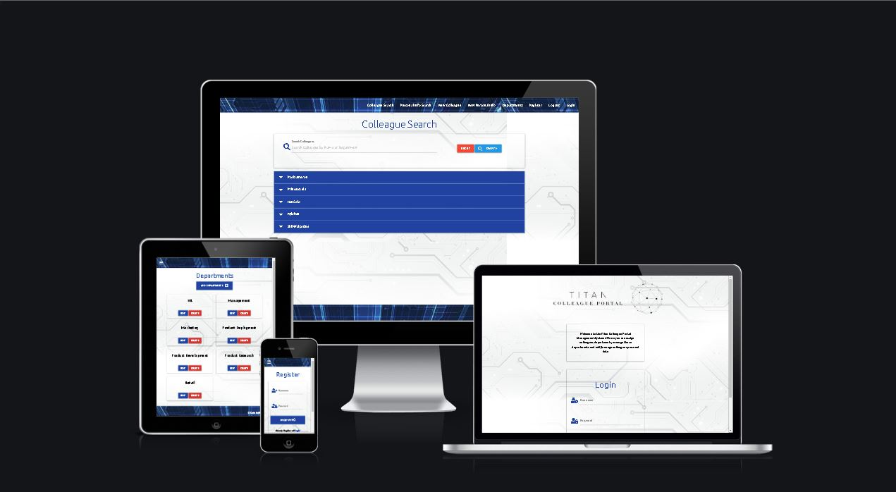
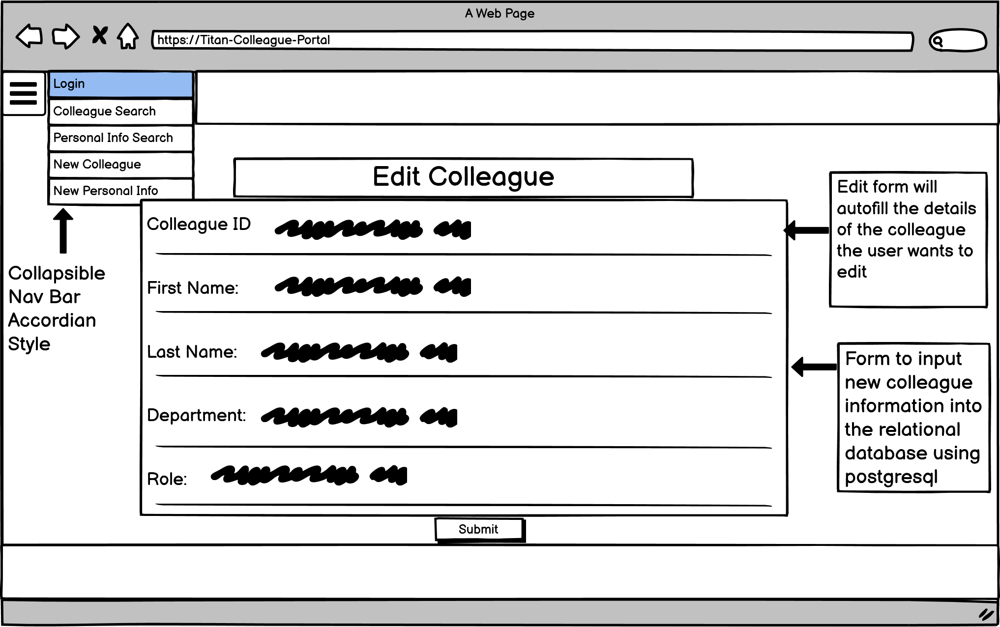

# Introduction

Welcome to the Titan Colleague Portal Management App. In this app you can add/edit/delete colleagues to your databases, assign that colleague within a specific department, and edit/delete those departments, and add/edit/delete that colleagues personal data with the ability to find their personal data quickly. 

In many business today, and many I have worked in, personal details and information are still kept in a huge folder somewhere in an office, and to find this data in a huge pile of paper is not efficient, or secure, especially concerning GDPR, and especially when your trying to find cover quickly for your business. Which is why this app has been developed to solve real world issues, for companies with large colleague numbers to deal with issues and problems more efficiently. This app allows companies to upload their colleagues information relating to their job role, which department they work in, including personal information such as contact numbers, all within a secure app at only lets the authorised users effect any changes.

Live site can be viewed here: https://titan-milestone-3.herokuapp.com/

# Contents

* [**User Experience UX**](<#user-experience-ux>)
    * [**Purpose**](#purpose)
    * [**User Stories**](#user-stories)
    * [**Wireframes**](#wireframes)
    * [**Web Design**](#web-design)
    * [**Data-Schema**](#data-schema)
    * [**Accessibility**](#accessibility)
* [**Website Walkthrough**](#website-walkthrough)
* [**Methods For Creating The Site**](#methods-for-creating-the-site)
* [**Testing**](#testing)
    * [**Development Testing**](#development-testing)
    * [**Deployment Testing**](#deployment-testing)
    * [**Code Validation**](#code-validation)
* [**Bugs**](#bugs)
* [**Deployment**](#deployment)

# User Experience (UX) design

## Purpose
  [Go to the top](#contents)

The purpose for this app is to safetly store colleagues details, to be able to organise your colleagues into departments, and be able to structure your business effectively, and handling this information in a app safetly so that every member of a management structure could have this at the tips of their fingers on their phones or on company desktops.

When I have been running stores myself, especially with high staff numbers. It takes time to find someones details to find cover for a shift or to get hold of them concerning overtime, or even making sure you know everyone who works within a department. This app streamlines precious time for management, while organising the information more effectively.

This is why in developing this app, we have used POSTGRESQL and SQLALCHEMY to create a relational database which ties colleagues to a specific department of your choice, and is why weve used MONGODB for the larger content of a colleagues personal information.

The target audience for this application would be any company with a large number of staff, it can also be used on a smaller scale but the inteded target audience is definately large companies.

In the creation of this app, security has been a focus of ours. Weve used Werkzeug to hash passwords and included defensive programming for users aswel. We have also restricted access to the site for only logged in users, apart from the register page so users can create a login. We have also put a minimum password length of 5 characters in in an effort for users to create stronger passwords for their accounts. From my experience from working in high staff number stores, I know that security is important. This is why we have used defensive programming to only allow the Admin user to be able to delete/add/edit any information on the app. This is to keep control of the app in Senior managements hands. As the importancce of this to be kept accurate for a business is imperative.

I think it definately meets the users demands and expectations of the site. That being a completely responsive modern looking application that can restrict access to help keep it secure and that delivers on being able to structure and better organise your colleagues details.

## User Stories
  [Go to the top](#contents)

1. - I the user, upon loading the site see an overview of what the application is
2. - I the user, have the ability to register a username and log into the application
3. - I the user, am notified when I have used the incorrect Username/Password
4. - I the user, am notified when i have successfully logged into the application
5. - I the user, can add/edit/delete a department into the database
6. - I the user, can add/edit/delete a colleague into the database
7. - I the user, can assign a colleague to a specific department
8. - I the user, can add/edit/delete a colleagues personal information into the database
9. - I the user, have the ability to log out, and am notified when this is successful.
10. - I the user, am notified of any actions taken such as edit/delete

## WireFrames
  [Go to the top](#contents)

- 

## Web Design
  [Go to the top](#contents)

This application has been designed with the following main principles:
- Simple and easy to navigate
- Completely responsive across all devices
- A light and tech style background that could be used for any business
- To look like a modern application
- Ensuring no contrast issues between background and foreground content 
- To provide a service for managers and businesses that will save time and help structure/organise their business.

I wanted to keep the design of this application as simple as possible, mainly for ease of use by the user but to also keep it as strictly a functional application as possible. Which is why for every action (add/edit/delete) taken on this application I have used flash messages to feedback to the user if the action they are performing has been successfull or not. With a modern aesthetic it could be used in any business. This played a big part in deciding the look, which is why ive used light technological themed images, which i believe do look modern while not tying the application down to a specific sector such as supermarkets etc. This is also why ive used the framework MaterializeCSS to help me achieve this. 

One thing i havent done is hide Nav Bar Elements. Usually these consist of register, login/logout. This is purposeful, mainly for the reason of this allows the admin user to register users while being logged in, which lets management control the flow and amount of new users that can use the application. Also in a high staff environment like a supermarket, its very common for managers to share computers. This is the reason i felt it wasnt necessary to hide Nav Bar elements.

## Data-Schema
  [Go to the top](#contents)

This is the data-schema devised for this application on the relational database side.

Entity Relationship Diagram KEY:
* colleague_id = This is an Integer
* first_name = This is a string
* last_name = This is a string
* role = This is a string
* department_id = This is an Integer
* department_name = This is a string
* id = This in an Integer

This entity relationship diagram shows a one to many relationship between the colleague id, and the department id, meaning many colleagues can go into one department, and that not many departments can go into a colleague.

In the relational database im using an id, of colleague and department to attatch these two pieces of data together (the relationship), and the compenents within them. In the colleague model im attatching the first, and last name and role and department id as the foreign key to this table of data. In the department table im simply using the id, department_name and the colleague relationship. 

What this allows the application to do is assign a colleague to a department, aswell as their role, which will also display their first and last name. Which allows the user to organise and structure their business and forfill the needs of real world issues that businesses today have . A feature we have also put in is that weve used a cascade delete so if a department is deleted the colleagues within the department will also be deleted.

In the Mongo Database I have the First name, Last name, colleague number, Department, Role Contact, and Date of birth, along with the users passwords that are being hashed by Werkzeug. This is why i have used mongoDB as this data set is far larger than the colleagues or departments which plays to the strengths of MONGODB.

## Accessibility
  [Go to the top](#contents)

During the development of this app, accessibility has been a big focus, as I understand how important it is. I have been using the chrome developer tool lighthouse to track how the application is doing in this area and below are some of the results from these tests.

However i would like to state that I have identified a bug and a limitation of materialize  in regards to the select dropdown boxes. These can be found in add_colleague.html and edit_colleague.html. In my quest to make my site 100% accessible I found that the select boxes (dropdown boxes) materialize use create an input line of html only viewable in chromes developer tools. This is the location of where i would need to put the associated aria labels for this component, however due to not being able to access this code i was unable to make these pages 100% accessible and instead they are sitting in the green at 91%.

# Website Walkthrough
  [Go to the top](#contents)

- Login page - This satisfies user story number 1 and 2.

- The user can also log out and will be notified of this. This satisfies user story number 9.

- The user is notified if the user has used the incorrect username or password, but will not distinguish which one. This satisfies user story number 3.

- Resistration page - This satisfies user story number 2.

- Upon successful login, the user will be directed to the Colleague Search page, where the user is alerted to their username and notified the user that login was successful, which satisfies user story number 4.

- The user can then add a new colleague, this satisfies user story number 6.

- The user can also assign this colleague into a particular department, this satisfies user story number 7.

- This is the form to edit colleagues and this information autofills the content the user wants to edit. This satisfies user story number 6.

- Colleagues can also be deleted, and as this action cannot be undone, have used modals to confirm the users actions. This satisfies user story number 6 and 10.

- This is where the user can add/edit/delete departments. This satisfies user story number 5.

- This is the form to add departments. This satisfies user story number 5.

- This is the form to edit departments. This satisfies user story number 5.

- Departments can be deleted, and as this action cannot be undone, have used modals to confirm the users actions. This satisfies user story number 5 and 10.

- This is where the user can search the non relational(mongodb) database via - first name, last name or what department they work in. This satisfies user story number 8.

- This is the form to add new personal information into the databsae. This satisfies user story number 8. 

- This is the form for editing the personal information for a colleague, and this form auto fills the content that the user is about to edit. This satisfies user story number 8.

# Methods For Creating The Site
  [Go to the top](#contents)

* [HTML5](https://en.wikipedia.org/wiki/HTML) (was used for structuring and presenting content of the website)
* [CSS](https://en.wikipedia.org/wiki/CSS) (used for the styling of the content)
* [Javascript](https://en.wikipedia.org/wiki/JavaScript) (used for the game programming)
* [Python](https://en.wikipedia.org/wiki/Python_(programming_language)) (used for programming the application)
* [Google Fonts](https://fonts.google.com/) (used for all the font styling within the project)
* [Chrome](https://www.google.com/intl/en_uk/chrome/) (used to debug and test the source code and to test site responsiveness)
* [GitHub](https://github.com/) (used to create the repository and store the projects code after pushed from Git)
* [Heroku](https://id.heroku.com/login) (Used for deployment of the application alongisde Github)
* [Gitpod](https://www.gitpod.io/) (used for the editing of code within the project for the site)
* [W3C Markup](https://validator.w3.org/) (used for validating the html5 code)
* [CSS Validator](https://www.cssportal.com/css-validator/) (used for validating the CSS code)
* [JSHint](https://jshint.com/) (this was also used for validating javascript code and double checking results from JSLint)
* [Am I Responsive](http://ami.responsivedesign.is/#) (used to generate the live site images, and also used to test responsiveness)
* [Balsamiq](https://balsamiq.com/) (This was used to generate the wireframes)
* [Postimages](https://postimages.org) (This was used to host the background image and header and footer to improve load times)
* [PeP8 online](http://pep8online.com/) (Used to check and prove pep8 compliance for models,routes.py files)
* [Materialize](https://materializecss.com/) (used for responsiveness and for the design of the application)
* [Werkzeug](https://werkzeug.palletsprojects.com/en/2.1.x/#) (This was used to hash the users passwords for security reasons)
* [Miro](https://miro.com) (This was used to create the entity relationship diagram)

# Testing
  [Go to the top](#contents)

## Development Testing
  [Go to the top](#contents)

Test            | Outcome                          | Result
--------------- | -------------------------------- | ------------
Navigation Bar  | Does the nav bar navigate to each page?| Pass 
Buttons | Does all buttons function as intended consistantly?| Pass
User Story 1 | I the user, upon loading the site see an overview of what the application is? | Pass
User story 2 | I the user, have the ability to register a username and log into the application | Pass
User Story 3 | I the user, am notified when I have used the incorrect Username/Password | Pass
User story 4 | I the user, am notified when i have successfully logged into the application | Pass
User story 5 | I the user, can add/edit/delete a department into the database | Pass
User story 6 | I the user, can add/edit/delete a colleague into the database | Pass
User story 7 | I the user, can assign a colleague to a specific department | Pass
User story 8 | I the user, can add/edit/delete a colleagues personal information into the database | Pass
User story 9 | I the user, have the ability to log out, and am notified when this is successful | Pass
User story 10 | I the user, am notified of any actions taken such as edit/delete | Pass
Responsiveness | Is the application responsive across all devices? | Pass
Accessibility | Is the application accessible to all users? | Pass (see accessibility section above)

## Deployment Testing
  [Go to the top](#contents)

Test            | Outcome                          | Result
--------------- | -------------------------------- | ------------
Checked against development version | Has the development testing criteria been applied to the deployed version? Any issues? | Pass, No issues
Visual Checks | Has visual checks been carried out in full on deployment version? | Yes, Pass
Code checked | Has the code been checked for errors? | Yes, Pass
Console errors | Is there any errors in the console? | No, Pass
Stability | Does using the forward and backward keys break the site? | No, Pass
Stability | Does the site work as intended? | Yes, Pass
Password | Does the site require a password length when registering? | Yes, minimum length 5, Pass

## Code Validation
  [Go to the top](#contents)

This is the validation for the CSS, as shown, no errors were found.

This is the validation for the models, ensuring that it is Pep8 compliant.

This is the validation for the routes.py file, ensuring that it is Pep8 compliant.

This is the validation for the JavaScript using JSHINT. 

- Below is the HTML validation:

This is the html validation for Add colleague page.

This is the html validation for Add Department page.

This is the html validation for Colleague Search page.

This is the html validation for Departments page.

This is the html validation for Edit Colleague page.

This is the html validation for Edit Department page.

This is the html validation for Edit Personal Info page.

This is the html validation for Login page.

This is the html validation for New Personal Info page.

This is the html validation for Personal Info Search page.

This is the html validation for Register page.

# Bugs
  [Go to the top](#contents)

One bug i had during the creation of this project was writing a search bar for the postgresql database using ORM sqlalchemy language which i unfortunately had to take out of this project. I was really hoping that i could provide this as i believe it would complete the app, however i was unable to get this consistantly working so its something il be looking to add as soon as ive figured it out.

The is no console errors, nor any present errors while checking in [Chrome](https://www.google.com/intl/en_uk/chrome/) Dev Toolswhile the app is running or performing tasks.

I have identified a bug and a limitation of materialize (previously stated in accessibility section) in regards to the select dropdown boxes. These can be found in add_colleague.html and edit_colleague.html. In my quest to make my site 100% accessible I found that the select boxes (dropdown boxes) materialize use create an input line of html only viewable in chromes developer tools. This is the location of where i would need to put the associated aria labels for this component, however due to not being able to access this code i was unable to make these pages 100% accessible and instead they are sitting in the green at 91%.

Another issue i encountered is with updating my models after heroku deployment. Due to the nature of this combined non relational and relational database project, I have been unable to migrate the changes from my models to the deployed version. This was when a error (internal server error) was found when adding the same information into the add colleagues page (same first name, last name, same role and same department) on my site. This was due to having 'unique=True' in my models for my first and last name fields. Initially this was done to prevent a user adding 100 versions of the same colleague into the database, however when trying to fix this error issue i have been unable to find a fix to upload to the deployed version. To resolve this issue i have placed error handlers which will gracefully handle the errors and redirect the user back to the main application without the use of the browsers navigation buttons.

# Deployment
  [Go to the top](#contents)

 This project was deployed to heroku and the steps to do this are below:

* sign up and log into heroku
* In the top right hand corner of the heroku website click new, then create new app
* Name app and select region
* click create app
* Install postgres under the resources tab
* Insert relevant config vars into heroku, such as IP,PORT,SECRET_KEY, DATABAS_URL
* You can click connect to github but this project used the CLI method.
* Log into heroku via CLI
* Create a git remote for heroku
* Push all changes to the staging area
* Push to heroku for your app to run and function.

